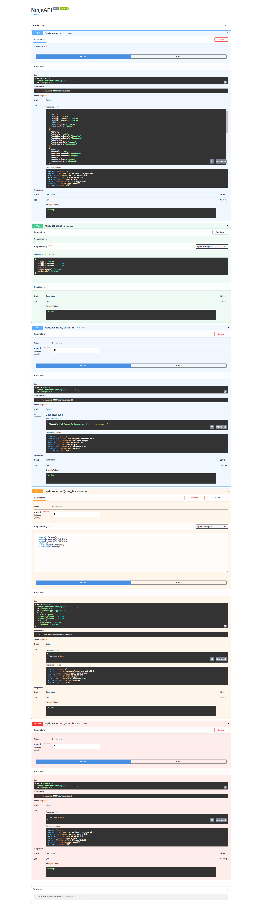
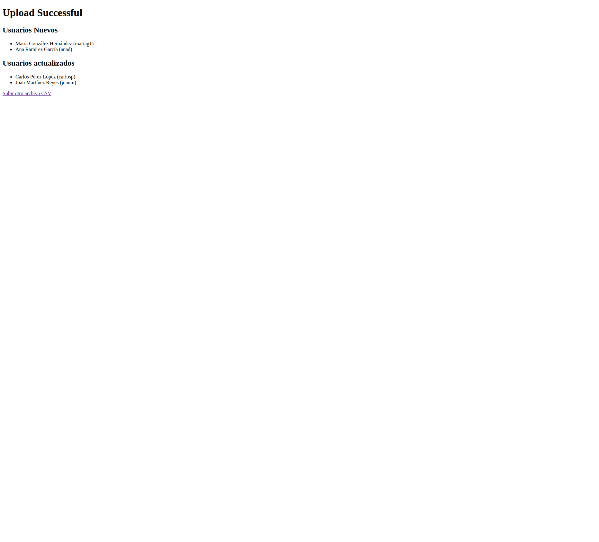

# Microservicios con Django y API REST con Django-Ninja

Autor: Ismael Grijalva Solorzano

## Descripción del Reto

Reto 1. Microservicios con Django y API REST con Django-Ninja

- Debe generarse un repositorio público en GitHub donde se tenga todo el código solicitado.
- Debe enviarse evidencia de ejecución del API en el foro.

## Tareas

1. Generar un repositorio público en GitHub, con la cuenta personal del estudiante.
2. Generar un proyecto en Django con el framework de Django-Ninja.
3. Generar un modelo de base de datos para almacenar los datos de usuarios con los siguientes datos:
   - Nombre
   - Apellido paterno
   - Apellido materno
   - Edad
   - Nombre de la cuenta
   - Contraseña
4. Generar un modelo de API REST con Django-Ninja para gestionar operaciones CRUD (Crear, Modificar, Eliminar) usuarios.
5. Generar un sitio web que permita la carga masiva de datos de usuario mediante un archivo CSV.
6. El proyecto del API debe llamarse `api_usuarios`.
7. El proyecto del sitio web debe llamarse `sitio_usuarios`.
8. Generar un archivo Dockerfile para generar el contenedor Docker de esta aplicación.

## Instalación y Ejecución

### Prerrequisitos

- Python 3.9 o superior
- Docker y Docker Compose

### Instrucciones

1. Clonar el repositorio:
   ```bash
   git clone https://github.com/revotk/Reto1-Django-Ninja.git
   cd microservicios-django

   docker-compose build

   docker-compose up -d

   docker-compose run web python manage.py makemigrations

   docker-compose run web python manage.py showmigrations

   # Creamos el admin de la app

   docker-compose run web python manage.py createsuperuser

   # Para terminar y bajar el contenedor ejecutamos 

   
   docker-compose down


## Uso

- Acceder al API en `http://localhost:8000/api/usuarios/`
- Acceder al sitio web para la carga masiva de datos en `http://localhost:8000/upload/`

## Evidencias

### API funcionando


### Carga masiva de datos


## Contribuciones

Las contribuciones son bienvenidas. Por favor, envía un pull request o abre un issue para discutir cualquier cambio que desees realizar.

## Licencia

Este proyecto está licenciado bajo la Licencia MIT. Consulta el archivo `LICENSE` para más detalles.
